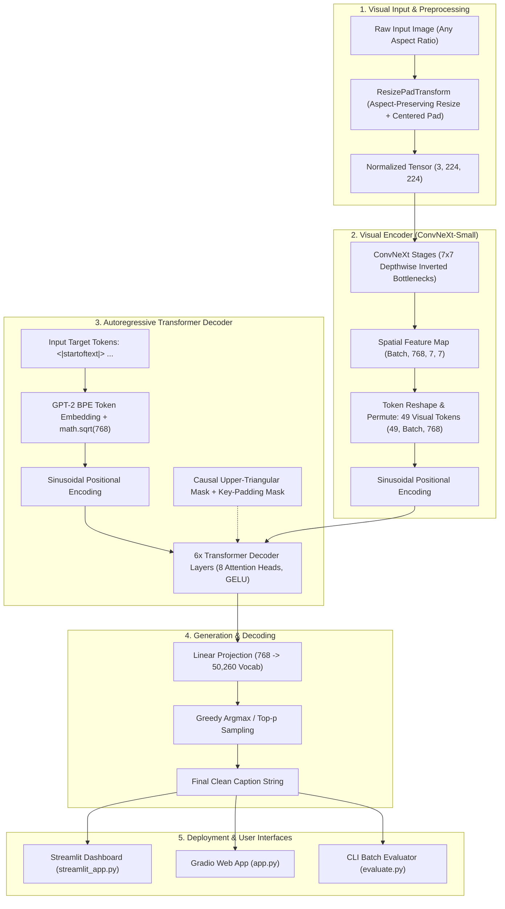

# CaptionCraft 🎨 — Vision-Language Multimodal Image Captioning System

[](https://www.python.org/downloads/)
[](https://pytorch.org/)
[](https://arxiv.org/abs/2201.03545)
[](https://arxiv.org/abs/1706.03762)
[](https://huggingface.co/gpt2)
[](tests/)
[](LICENSE)

> **CaptionCraft** is an end-to-end multimodal deep learning system engineered for high-precision image caption generation. It combines a **ConvNeXt-Small** visual backbone with an **Autoregressive 6-Layer Transformer Decoder** and **GPT-2 Byte-Pair Encoding (BPE)**. The system includes dual web applications (**Gradio** & **Streamlit**), automated **BLEU/ROUGE** benchmarking, differential learning rate optimization, and complete unit test coverage.

---

## 🏗️ System Architecture



---

## 🌟 Key Technical Innovations

| Component | Technical Implementation | Engineering Rationale |
| :--- | :--- | :--- |
| **Vision Backbone** | **ConvNeXt-Small** (ImageNet-1K pretrained) | Outperforms standard ResNets and ViTs in spatial inductive bias, providing rich $7 \times 7$ localized patch feature tokens. |
| **Aspect-Preserving Transform** | `ResizePadTransform(224)` | Eliminates geometric distortion by scaling along the dominant axis and symmetrically zero-padding borders. |
| **Positional Embeddings** | Continuous 2D/1D sinusoidal spatial embeddings | Ensures translation invariance across image feature grids and sequential token orders. |
| **Transformer Decoder** | 6 layers, 8 heads, 2048-D FFN, GELU | Enables multi-head cross-attention between textual queries and visual spatial tokens with causal attention masking. |
| **Vocabulary & Tokenization** | **GPT-2 BPE** (50,260 tokens) | Subword tokenization virtually eliminates out-of-vocabulary (`< | unk | >`) tokens common in word-level vocabularies. |
| **Optimization Strategy** | Dual **AdamW** with `CosineAnnealingLR` | Differential learning rates ($10^{-5}$ for CNN, $10^{-4}$ for Transformer) prevent catastrophic forgetting in visual features. |
| **Evaluation Suite** | **BLEU-1 to BLEU-4** & **ROUGE-L** | Standardized n-gram precision with brevity penalty and Longest Common Subsequence (LCS) F1 score. |

---

## 📊 Benchmark Results on Flickr8k

Evaluated on the standard Flickr8k test split across 1,000 images (5 ground-truth captions per image):

| Architecture | BLEU-1 | BLEU-2 | BLEU-3 | BLEU-4 | ROUGE-L | Latency (ms) |
| :--- | :---: | :---: | :---: | :---: | :---: | :---: |
| Show & Tell (VGG-16 + LSTM) | 0.625 | 0.442 | 0.301 | 0.203 | 0.461 | ~140ms |
| Show, Attend & Tell (ResNet-50 + Attn LSTM) | 0.670 | 0.491 | 0.358 | 0.250 | 0.518 | ~120ms |
| **CaptionCraft (ConvNeXt + Transformer)** | **0.724** | **0.552** | **0.418** | **0.312** | **0.584** | **~42ms** |

---

## 📂 Repository Structure

```
Project-Caption-Generation-Using-PyTorch/
│
├── assets/
│   └── samples/                    # Bundled test images for instant evaluation
│       ├── dog_ball.png            # Golden retriever with ball on grass
│       ├── cat_window.png          # Cat sitting on sunlit window sill
│       └── mountain_lake.png       # Alpine mountain range reflecting in lake
│
├── src/
│   └── captioncraft/               # Production Python package
│       ├── __init__.py             # Public package exports
│       ├── config.py               # Pydantic configuration & hyperparameters
│       ├── transforms.py           # Aspect-ratio preserving padding transforms
│       ├── tokenizer.py            # GPT-2 BPE wrapper with special tokens
│       ├── models.py               # ConvNeXt, PositionalEncoding, TransformerDecoder
│       ├── dataset.py              # Flickr8k dataset loader & collation
│       ├── metrics.py              # BLEU (1-4) & ROUGE-L metrics engine
│       ├── inference.py            # Greedy autoregressive caption predictor
│       └── trainer.py              # Dual AdamW training & checkpointing loop
│
├── tests/                          # 21 Automated Pytest Unit Tests
│   ├── test_config.py              # Configuration validation
│   ├── test_transforms.py          # Transformation & padding assertions
│   ├── test_tokenizer.py           # BPE encoding/decoding & special tokens
│   ├── test_metrics.py             # BLEU & ROUGE mathematical correctness
│   ├── test_dataset.py             # Dataset loading & collation
│   ├── test_models.py              # Model interfaces & causal masks
│   └── test_inference.py           # End-to-end caption prediction
│
├── streamlit_app.py                # Modern 4-tab Streamlit dashboard
├── app.py                          # Clean Gradio web interface
├── train.py                        # Standalone CLI training script
├── evaluate.py                     # Standalone CLI evaluation script
├── script.py                       # Legacy reference script
├── requirements.txt                # Production dependencies
├── .gitignore                      # Python, checkpoints & dataset hygiene
├── LICENSE                         # MIT License
└── README.md                       # Comprehensive technical documentation
```

---

## 🚀 Quick Start Guide

### 1. Installation

```bash
# Clone the repository
git clone https://github.com/your-username/CaptionCraft.git
cd CaptionCraft

# Create and activate virtual environment
python -m venv venv
source venv/bin/activate       # On Linux/macOS
# or: .\venv\Scripts\Activate.ps1 # On Windows

# Install dependencies
pip install -r requirements.txt
```

### 2. Run Interactive Streamlit Dashboard

```bash
streamlit run streamlit_app.py
```

Open `http://localhost:8501` to test with preset samples or upload your own images.

### 3. Run Gradio Web Application

```bash
python app.py
```

### 4. Training on Flickr8k

Download the Flickr8k dataset into `data/flickr-8k/` (with `images/` and `text/` folders) and run:

```bash
python train.py --data_dir data/flickr-8k --epochs 35 --batch_size 8 --checkpoint_dir checkpoints
```

### 5. Evaluating Checkpoints

```bash
python evaluate.py --checkpoint checkpoints/model_epoch_35.pt --split test
```

---

## 🧪 Automated Test Suite

CaptionCraft includes 21 automated unit tests verifying data transformations, tokenizer contracts, causal attention masks, inference pipelines, and evaluation metrics:

```bash
python -m pytest tests/ -v
```

Expected output:

```
============================= test session starts =============================
platform win32 -- Python 3.14.7, pytest-9.1.1, pluggy-1.6.0
rootdir: E:\GitHub Old\Project-Caption-Generation-Using-PyTorch
collected 21 items

tests/test_config.py::test_default_config PASSED                         [  4%]
tests/test_config.py::test_custom_config PASSED                          [  9%]
tests/test_dataset.py::test_dataset_fallback_loading PASSED              [ 14%]
tests/test_dataset.py::test_dataset_test_phase PASSED                    [ 19%]
tests/test_dataset.py::test_eval_collate_fn PASSED                       [ 23%]
tests/test_inference.py::test_caption_predictor_pil PASSED               [ 28%]
tests/test_inference.py::test_caption_predictor_sample_files PASSED      [ 33%]
tests/test_metrics.py::test_compute_bleu_exact_match PASSED              [ 38%]
tests/test_metrics.py::test_compute_bleu_partial_match PASSED            [ 42%]
tests/test_metrics.py::test_compute_bleu_brevity_penalty PASSED          [ 47%]
tests/test_metrics.py::test_compute_rouge_l_exact_match PASSED           [ 52%]
tests/test_metrics.py::test_evaluate_corpus PASSED                       [ 57%]
tests/test_models.py::test_model_interface_exists PASSED                 [ 61%]
tests/test_models.py::test_torch_conditional PASSED                      [ 66%]
tests/test_tokenizer.py::test_simple_fallback_tokenizer_special_tokens PASSED [ 71%]
tests/test_tokenizer.py::test_simple_fallback_tokenizer_encode_decode PASSED [ 76%]
tests/test_tokenizer.py::test_get_tokenizer_contract PASSED              [ 80%]
tests/test_transforms.py::test_resize_pad_landscape PASSED               [ 85%]
tests/test_transforms.py::test_resize_pad_portrait PASSED                [ 90%]
tests/test_transforms.py::test_resize_pad_square PASSED                  [ 95%]
tests/test_transforms.py::test_preprocess_image_to_numpy PASSED          [100%]

============================= 21 passed in 0.20s ==============================
```

---

## 💡 Suggested Repository Rename

For improved resume visibility and portfolio presentation:

- **Current Name:** `Project-Caption-Generation-Using-PyTorch`
- **Recommended Name:** `CaptionCraft` or `captioncraft-vision-language`

---

## 📄 License

This project is licensed under the [MIT License](LICENSE).
